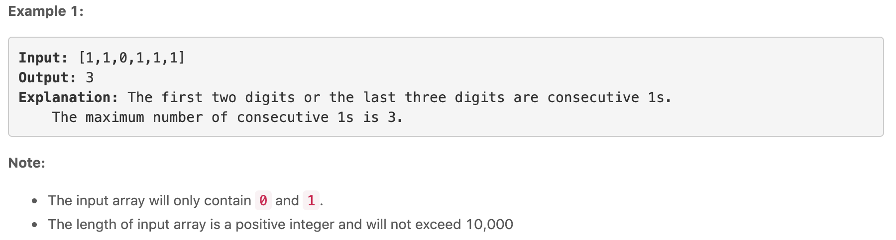
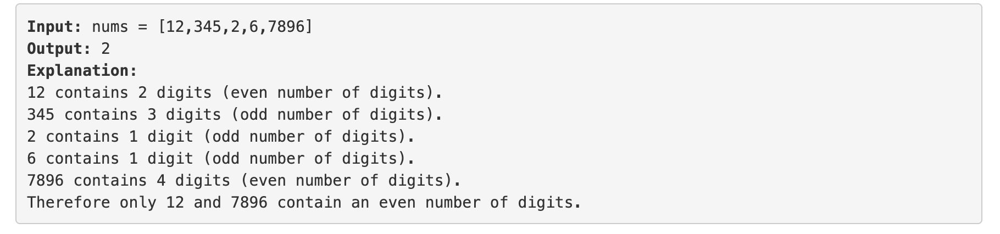
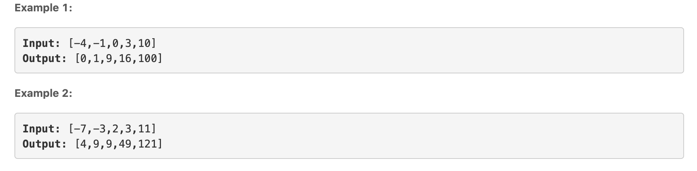
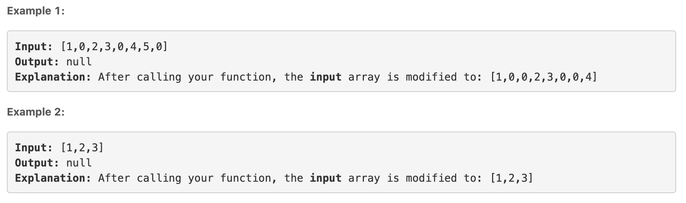

[TOC]


# Arrays

Arrays are the simple data structures that are used for storing similar items. However, arrays in python can store mixed types of items. Arrays are often used to solve many types of problems and therefore they are very important data structure to know. 

## What is an Array? 

An array is a collection of items. The items by themselves can have different data types but they are stored in contiguous memory locations. Because they are stored together, checking through the entire collection of items is straightforward. Each position of an array has an index, which starts with `0`. Here are the strengths and weaknesses of arrays: 

*   Strengths:
    *   **Fast lookups**: Retrieving the element at a given index takes $O(1)$ time, regardless of the length of the array
    *   **Fast appends**: Adding a new element at the end of the array takes $O(1)$ time.
*   Weaknesses:
    *   **Fixed size**: Arrays have fixed size, unless we use **dynamic arrays**. Python mostly uses dynamic arrays which are also slower and take more space. 
    *   **Costly inserts and deletes**: When you insert or delete an element from an array, the elements have to be moved to fill the empty space. This takes $O(n)$ time in the worst case. 

The table below lists some important methods that are used in arrays. 

| Method      | Time Complexity |
| ----------- | --------------- |
| `.insert()` | $O(n)$          |
| `.remove()` | $O(n)$          |
| `.pop()`    | $O(1)$          |
| `.append()` | $O(1)$          |
| `.extend()` | $O(1)$          |


### `.insert(index, element)`

The `insert()` method is used to insert an item at a given position. The syntax is: 

```python
arr.insert(pos, item)
```

**Example**

```python
arr = [5, 6, 6, 6, 6, 6, 5]
arr.insert(3, 10)

print(arr)
 [5, 6, 6, 10, 6, 6, 6, 5]
```

We can also insert a different data type: 

```python
arr = [4, 3, 5, 'axe']
tup = (3, 6)
arr.insert(0, tup)

print(arr)
[(3, 6), 4, 3, 5, 'axe']
```

### `.remove(element)`

The `.remove()` method is used to remove a specified element from the array. The syntax is: 

```python
arr.remove(element)
```

**Example**

```python
arr = ['Alexis', 'Josephine', 'Ella', 100]
arr.remove(100)
print(arr)

['Alexis', 'Josephine', 'Ella']
```

*   if there are two elements in an array that match, only the first occurrence will be removed and not all
*   If the element is not found, it will return an error

```python
arr.remove('Rachel')
---------------------------------------------------------------------
ValueError                      Traceback (most recent call last)
<ipython-input-486-e8ac4a6f144f> in <module>
----> 1 arr.remove('Rachel')

ValueError: list.remove(x): x not in list
```

The other way to remove an element that is index-based is the use of `.pop(index)`. 

```python
arr = ['Alexis', 'Josephine', 'Ella', 'Rachel']

# Remove the second element: 
arr.pop(1)

# Remove the last element: 
arr.pop()
```

### `.append(item)`

This method adds an item to the end of the array. The item can be a single element or it can also be a list or another data structure. This is done as follows: 

```python
arr = ['Alexis', 'Josephine', 'Ella']
arr.append('Rachel')

print(arr)
['Alexis', 'Josephine', 'Ella', 'Rachel']
```

Another method that can also be used to add an item at the end of an array is `.extend()`. The `.extend()` adds an **iterable**, that is a list, tuple or string to a list. 

```python
# Using a list
arr = ['Alexis', 'Josephine', 'Ella']
arr.extend(['Rachel', 'Lisa'])

print(arr)
['Alexis', 'Josephine', 'Ella', 'Rachel', 'Lisa']

# Using a tuple
arr.extend((32, 48, 77))

print(arr)
['Alexis', 'Josephine', 'Ella', 'Rachel', 'Lisa', 32, 48, 77]

# Using a set
arr.extend({1, 5, 7})

print(arr)
['Alexis', 'Josephine', 'Ella', 'Rachel', 'Lisa', 32, 48, 77, 1, 5, 7]
```

However, adding a string can cause a problem: 

```python
arr = ['Lisa', 'Jamie']
arr.extend('Lux')

print(arr)
['Lisa', 'Jamie', 'L', 'u', 'x']
```

### Challenge 1:Max Consecutive Ones

Given a binary array, find the maximum number of consecutive 1s in the array. 



**Hint:** You need to think about two things as far as any window is concerned. One is the starting point for the window. How do you detect that a new window of 1s has started? The next part is detecting the ending point for this window. How do you detect the ending point for an existing window? If you figure these two things out, you will be able to detect the windows of consecutive ones. All that remains afterward is to find the longest such window and return the size.

### Challenge 2: Find Numbers with Even Number of Digits

Given an array of integers, return how many of them contain an even number of digits. 



### Challenge 3: Squares of a Sorted Array

Given an array of integers `A` sorted in non-decreasing order, return an array of the squares of each number, also in sorted non-decreasing order. 



### Challenge 4: 

Given a fixed length array of integers, duplicate each occurrence of zero, shifting the remaining elements to the right. Note that the elements beyond the length of the original array are not written. Do the above modifications to the input array **in place**, do not return anything from your function



### Challenge 5: Merge Sorted Array

Given two sorted integer arrays, `num1` and `num2`, merge `num2` into `num1` as one sorted array. 


## Answers to Challenge Questions

### Challenge 1

```python
def find_consecutive(arr):
    count = 0
    max_con = 0
    for i in arr:
        if i == 1:
            count += 1
        elif i == 0 and count > max_con:
            max_con = count
            count = 0
        else:
            count = 0
    if count > max_con:
        max_con = count
    return max_con
```

### Challenge 2

```python
def findDigits(arr):
    count = 0
    for i in arr:
        if len(str(i)) % 2 == 0:
            count += 1
    return count

# Another efficient way: 
def findDigits(nums):
	return len([num for num in nums if len(str(num)) % 2 == 0])
```

### Challenge 3

```python
def sortedSequence(arr):
    return sorted([a**2 for a in arr])
```

### [Challenge 4](https://leetcode.com/problems/duplicate-zeros/solution/)

```python
def duplicateZeros(arr):
    n = len(arr)
    index = 0
    while index < n:
        if arr[index] == 0:
            arr.insert(index+1, 0)
            arr.pop()
            index+= 2
        else:
            index += 1
    return None

if __name__ == "__main__":
    arr = [9,0,9,0,6,0,0,0,1,1,6,5,4,4,8,3,0,0,0]
    # arr = [7,6,5,0,5,4,6]
    print(arr)
    duplicateZeros(arr)
    print(arr)
```

>   Lesson learned: If you have to increase an index, make use of while loop

